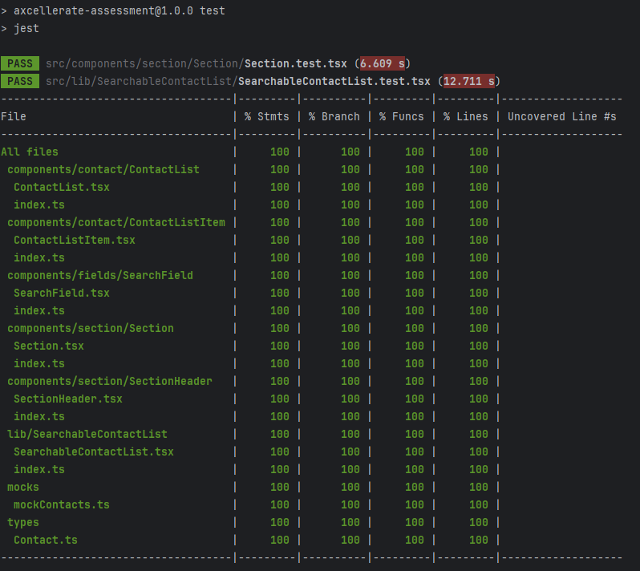

## aXcelerate technical assessment

### Purpose
This is my submission to the aXcelerate technical assessment to showcase my frontend development skills.

This submission includes:
- Storybook integration
- Jest Unit Test (minimal tests but with 100% coverage)
- Atomic design approach for React components with CSS styling

### Getting Started

#### Start the app
```shell
npm install
npm run dev # run storybook
```

#### Run tests
```shell
npm run test
```

### Technical Details

#### Directory Structure

| Directory  | Purpose                                                   |
|:-----------|:----------------------------------------------------------|
| components | contains smaller components used by the component library |
| lib        | Exported components by the component library              |
| mocks      | mock data                                                 |
| types      | type definition for shared interfaces                     |

#### Testing Strategy
My strategy for testing is to capture all the behaviour from the entrypoint of the app first (in my case, it is the SearchableContactList component).
This allowed me to cover majority of the application code while creating robust tests.

Once all behaviours and scenarios are covered from the entrypoint, I analyse the coverage report for code I have missed
and critically assess whether the line of code requires a test or can be removed. This ensures that
the code I create is lean and purposeful.



#### Technology of Choice

Since the purpose of the assessment is to eventually create a component library, I imagined that bundle size is an important
non-functional requirement for this assessment. I used React and CSS to create my components with a few
additional libraries for fonts and icons.